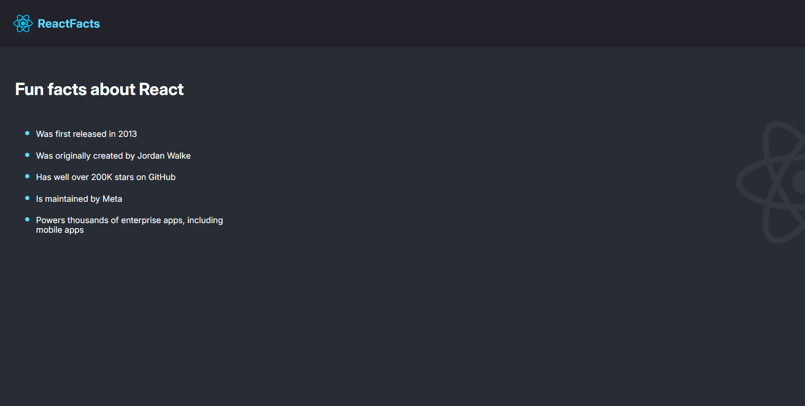

# ⚛️ React Facts

A simple React app built as my **first project with Vite + React**.  
It displays fun facts about React using reusable components and JSX.

---

## 🚀 Features
- Built with [Vite](https://vitejs.dev/) ⚡ (super-fast dev & build tool)
- React components + JSX
- Basic CSS styling

---

## 🧑‍💻 What I Learned
- Setting up a React project with Vite
- Creating and using functional components
- Importing and displaying assets (images, SVGs)
- Rendering content dynamically with JSX

---

## 🌐 Live Demo
👉 [React Facts](https://react-facts-imissh3r.vercel.app/)  

---

## 📸 Screenshot

**Desktop View**

**Mobile/Tablet View**

---

## 🙏 Credits
This project was built by following the  
[Learn React for Free course on Scrimba](https://scrimba.com/learn-react-c0e)  
taught by [Bob Ziroll](https://scrimba.com/@bobziroll).  

---

⚔️ *“Being strong isn’t just about having power, it’s about knowing how to use it.”* — Zoro
